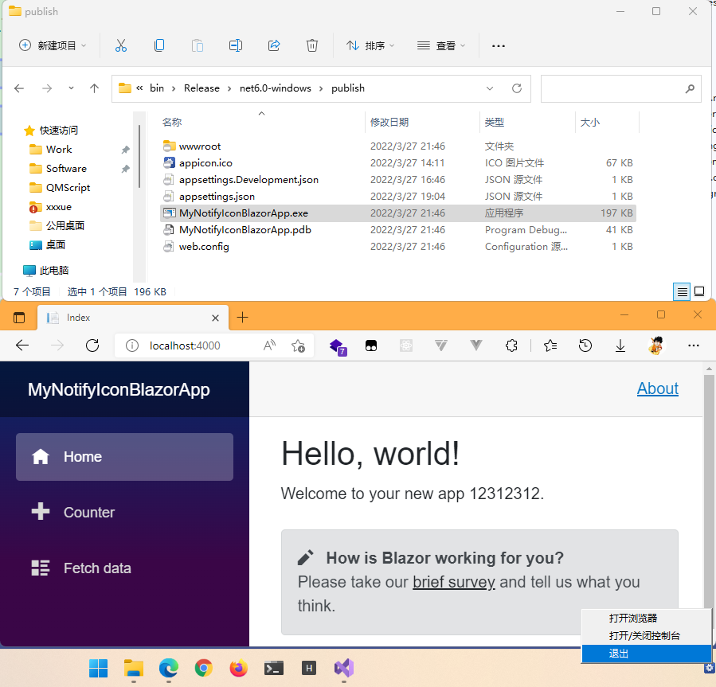

# MyNotifyIconApp

> 只适用于 windows,  因为是用winform实现的

# 开发环境

- VS 2022
- .NET 6

# 功能

- 添加任务栏图标 ( 托盘图标 )

  - 添加右键菜单 (打开浏览器 / 控制台 /退出)

  - 双击打开控制台,

- 启动一个web服务器 ( MVC , Razor , Blazor 等等 )

- web服务器启动成功,自动打开浏览器页面

# 核心代码

- NotifyIconUtils.cs    **( 核心工具类代码 )**
- Program.cs  (程序的入口)
- WebProgram.cs    (非常普通的 web Host 代码)
- 其他代码均为普通web代码

# 提示

想要看效果,

VS 需要改为 Release 运行

或者 发布后运行

# 截图

